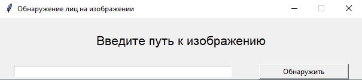
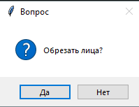

# GUIFaceDetection

*This is my first experience with Python.*
*This is my first experience with OpenCV.*
*This is my first experience with Tkinter.*

------
#### If the Haar Cascade file is in the directory:

#### If the Haar Cascade file is not in the directory:

------
